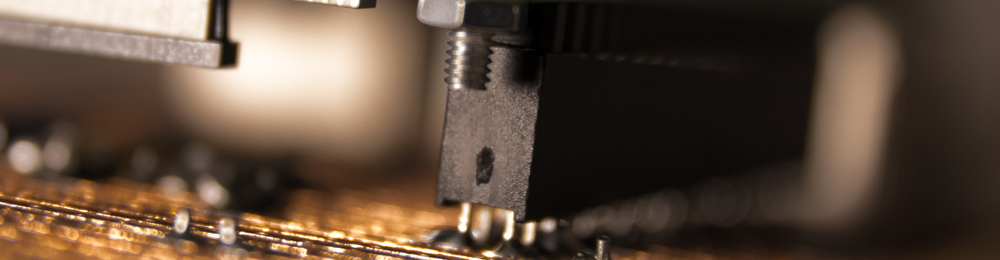
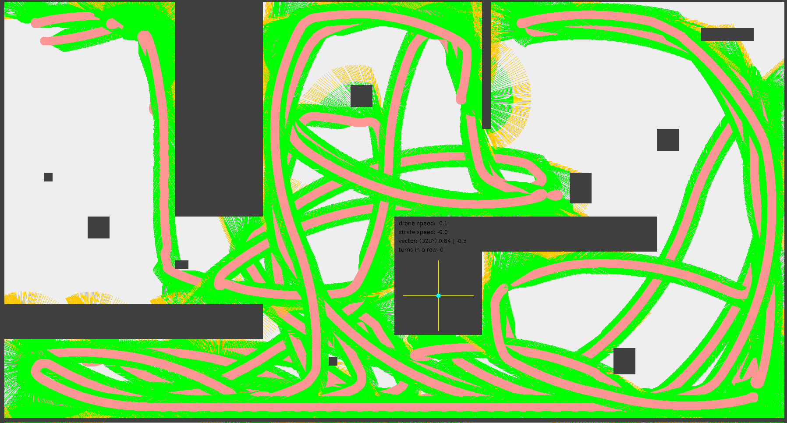
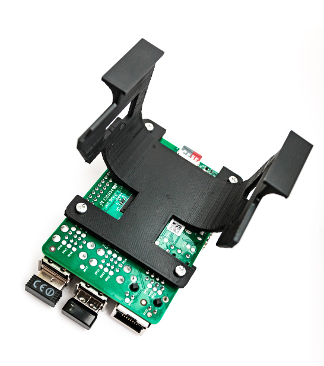
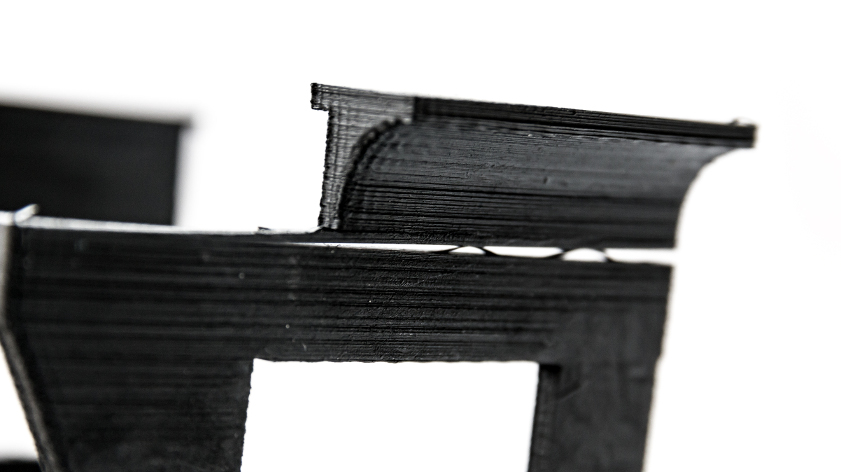

# Mounting hardware on the drone

We want to mount the PI, the mainboard and some sensors on the drone - in a stable and robust manner. 
It's not as easy as we thought..

## Basic considerations

At the beginning of our drone project, we wrote a 2D-simulator software to find out how many distance sensors
are at least required for autonomous flying and in which angle to mount them ideally. 

By this simulations, we came to the conclusion that two sensors mounted in a 45° angle are enough for basic 
obstacle detection, but the results can be improved significantly by adding an additional upfront-looking sensor.
But how should we attach the sensors, the PI and the connecting wires on our small drone?

## Mounting the sensors

We decided that the drones feets could be a suitable place for the laterally affixed sensors. The original drone feet 
consist of a simple stilt, whereby the front feet have some space to carry a small antenna board.

Our plan was to replace the original stilts with some new ones out of a 3D printer. The front stilts should still include 
the antenna, but also have some kind of engagement to mount the HC-SR04 distance sensor in a 45° angle. And that is what 
came out of the printer (left side) in comparison with the original food (right side):

The base frame of the drone already has enough space for the wiring, so the first part was done.

## Mount the PI and the custom board

First, we thought that we could mount the custom board and the PI at the bottom of the drone. But that's not possible 
because of two sensors and a fan pointing to the ground. so we decided to put all the stuff on the top of the drone. 
In order to do this we printed another plastic 3D object shaped like a saddle, fitting on the drone's storage battery. 
And here is how it looks like:

Our PI can now easily be screwed on this saddle, and the custom board will be plugged into the PI. We ran the sensor wires
through the drone's head (no, it does not look so great, but the risk of cutting a wire by a rotor blade is much lower!) 
and they can now easily be plugged into our custom board.

Will the drone still be able to take off with such an additional weight? Have a look at our first flighting test here:

## Unresolved problems

By now, the following problems need to be solved in the next steps:

### On-board energy supply

We all pretty sure that our PI needs some electrical energy to work. As the drone has a 12V accumulator on board which would 
kill our PI, we need a way to supply the PI with energy. We will tell you on another day about how we solved that.

### Our printed 3D objects are very fragile and susceptible for breaking

Especially in the printing direction of the synthetic fibres. 

We are now searching for other materials or printing 
technologies to find a more suitable solution.

